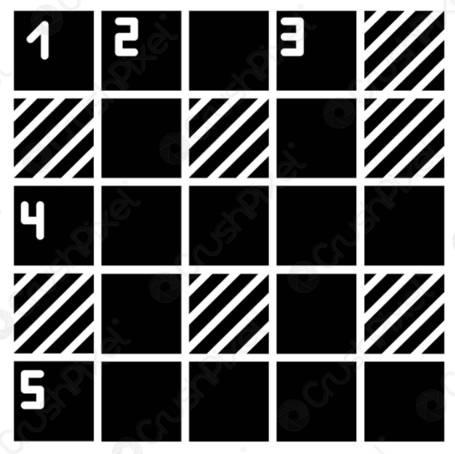
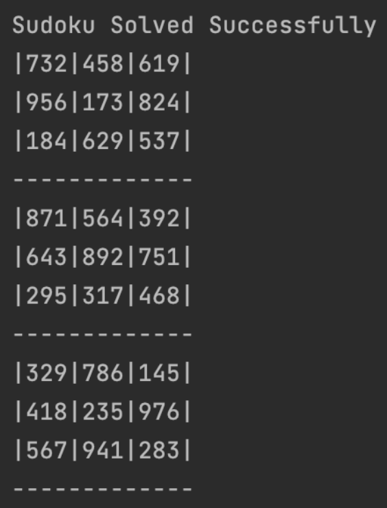

# Solve Sudoku-Game
Sudoku Game 🎮 with Java console



### Tools and Languages Used
```
java 
```
### Game Play
```
- To start solve the game you must add your sudoku data in array int[][] board
- Start the app
- Enjoy 😁
```
### Example of sudoku in console

### Error 😬
```
- If your data not correct => Unsolved Board :(
```
